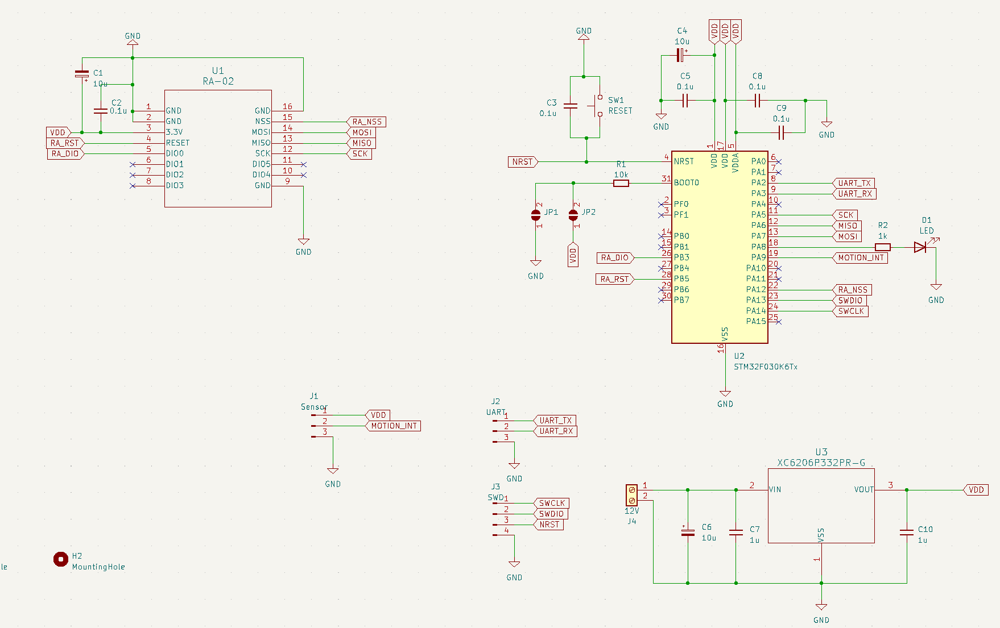
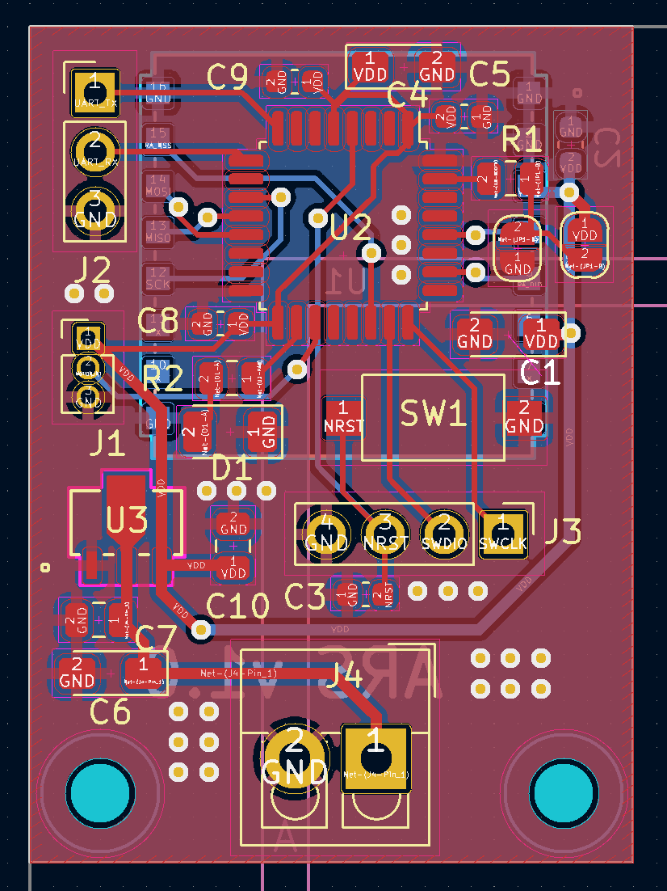
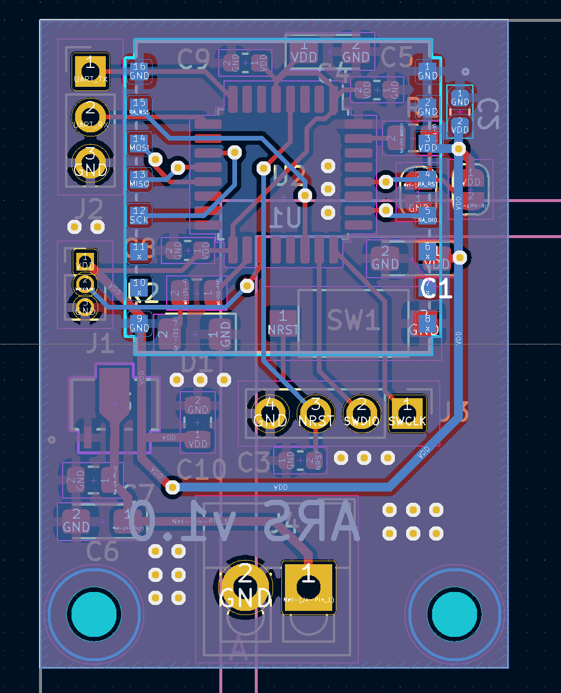
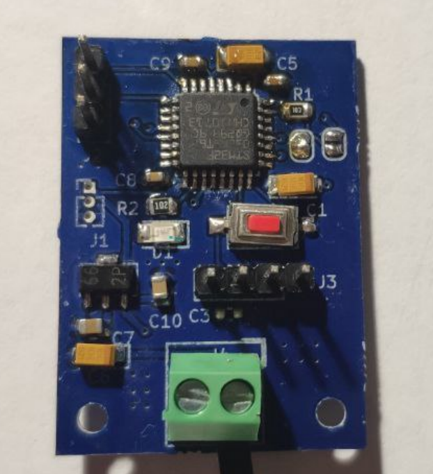

# ARS - Alarm System

My first project based on the STM32 microcontroller family. It consists of an alarm module and a receiver. The alarm module utilizes the RCWL-0516 motion sensor, the STM32F030K6T6 microcontroller, which wakes up upon interruption from the sensor, and communicates the alarm using the LoRa module RA-02 at 433 MHz.

As the receiver, an ESP32 TTGO LoRa 433MHz development board with an OLED display is used. The receiver spends most of its time in a sleeping state to reduce power consumption. Upon receiving an alarm signal, the receiver wakes up, displays a text status on the screen, and activates an LED indicator. The LED continues to blink even in sleep mode until the user resets the alarm state. This is made possible by the ULP coprocessor.

## TODO

- Configure the alarm module to operate on battery power.
- Implement a buzzer on the receiver to provide an audible signal in case of an alarm.
- Redesign the enclosure for the receiver.
- Design an enclosure for the alarm module.
- Add encryption
- Add protection from replay attacks
